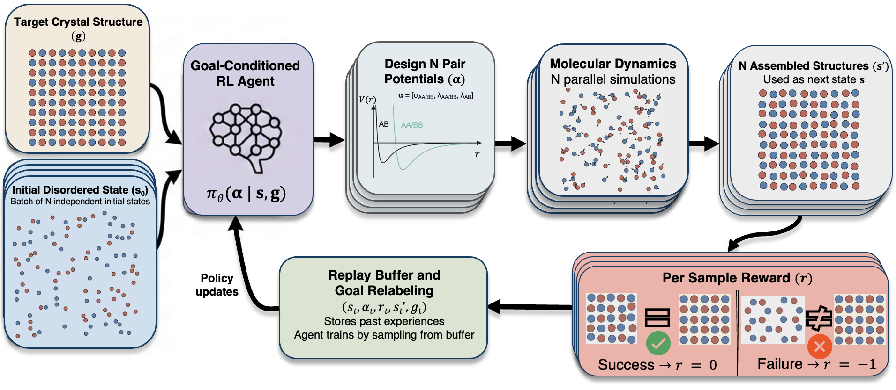

# GCRL for Inverse Design of Colloidal Crystals

**From Disorder to Crystal: Goal-Conditioned Reinforcement Learning for Inverse Design of Binary Colloidal Structures**

Harry Papargyriou¹, Ryan Soucek², Hsiao-Yen Beth Wei², Jeetain Mittal²·³·⁴, Ali Mesbah¹·*

¹ Department of Chemical and Biomolecular Engineering, University of California, Berkeley  
² Artie McFerrin Department of Chemical Engineering, Texas A&M University  
³ Department of Chemistry, Texas A&M University  
⁴ Interdisciplinary Graduate Program in Genetics and Genomics, Texas A&M University  

*Preprint — July 2026*

---

## Table of Contents

- [Abstract](#abstract)
- [Framework](#framework)
- [Method Summary](#method-summary)
  - [Inverse Design as a GCRL Problem](#inverse-design-as-a-gcrl-problem)
  - [Algorithm](#algorithm)
  - [Network Architecture](#network-architecture)
  - [Molecular Dynamics Protocol](#molecular-dynamics-protocol)
- [Installation](#installation)
  - [Prerequisites](#prerequisites)
  - [HOOMD-blue Installation](#hoomd-blue-installation)
  - [OVITO Installation](#ovito-installation)
- [Usage](#usage)
  - [Basic Training](#basic-training)
  - [Configuration](#configuration)
  - [Output Files](#output-files)
  - [Post-Training Analysis](#post-training-analysis)
- [Project Structure](#project-structure)
- [Core Components](#core-components)
  - [1. Training Script](#1-training-script-run_policypy)
  - [2. MD Simulation Engine](#2-md-simulation-engine-md_enginepy)
  - [3. Structure Classification](#3-structure-classification-structure_recognitionpy)
  - [4. Replay Buffer](#4-replay-buffer-replay_bufferpy)
  - [5. Visualization](#5-visualization-make_figurespy)
  - [6. Configuration Generator](#6-configuration-generator-generate_confpy)
- [Workflow](#workflow)
- [System Requirements](#system-requirements)
- [Important Notes](#important-notes)
- [Multi-Node GPU Execution](#multi-node-gpu-execution)
- [Troubleshooting](#troubleshooting)
- [Data Availability](#data-availability)
- [Citation](#citation)
- [Contact](#contact)

---

## Abstract

Colloidal self-assembly provides a scalable route to fabricating materials with emergent, structure-encoded properties. However, engineering pair potentials that realize target crystal motifs remains difficult as the interaction parameter space is highly non-linear, successful crystallization pathways are sparsely distributed within the design space, and self-assembly is co-governed by thermodynamic and kinetic accessibility. We present a goal-conditioned reinforcement learning (GCRL) framework that maps target crystal structures to experimentally motivated modified Lennard-Jones pair-potentials, inspired by DNA-functionalized particle interactions, where success of self-assembly is evaluated solely on whether the target structures are realized. The proposed GCRL framework relies on hindsight experience replay, which allows the agent to learn from all simulation outcomes, including runs that produce non-target structures. GCRL is validated on seven binary colloidal target crystal structures spanning 2D and 3D motifs — square single stripe, binary triangular kagome, square lattice, open honeycomb, simple cubic, cubic diamond and body-centered cubic — with the first two being previously realized only with purely repulsive potentials. GCRL does not require physically informed initialization of interaction parameters. By restricting pair potentials to single-well modified LJ forms while operating on a parameter space with sparse crystallization events, GCRL brings inverse design closer to the laboratory bottom-up synthesis of colloidal superlattices.

---

## Framework



The closed-loop inverse design framework starts from a target crystal structure **g** and a disordered particle configuration **s**. The goal-conditioned RL policy π_θ(**α** | **s**, **g**) proposes an action **α** = [σ_AA/BB, λA_A/BB, λ_AB] consisting of modified Lennard-Jones pair potential parameters for like- and unlike-particle species. These potentials are evaluated through coarse-grained implicit-solvent MD simulations (HOOMD-blue, Langevin dynamics) under a temperature-annealing schedule (T* = 1 → 0.01). The final assembled configuration s′ is structurally analyzed and converted to a binary reward signal r ∈ {0, −1}. Transitions (s, α, r, s′, g) are stored in a replay buffer; hindsight experience replay (HER) relabels trajectories where non-target structures form, so that failed episodes still contribute useful learning signal.

---

## Method Summary

### Inverse Design as a GCRL Problem

The interaction parameter vector $\mathbf{a} = [\sigma_{AA}, \sigma_{AB}, \lambda_{AA}, \lambda_{AB}]^\top \in \mathbb{R}^4$ defines modified Lennard-Jones potentials:

```math
u_{ij}(r) = \begin{cases}
u^{\text{LJ}}_{ij}(r) + (1 - \lambda_{ij})\,\varepsilon & r \leq 2^{1/6}\sigma_{ij} \\
\lambda_{ij}\, u^{\text{LJ}}_{ij}(r) & r > 2^{1/6}\sigma_{ij}
\end{cases}
```

where the standard LJ potential is:

```math
u^{\text{LJ}}_{ij}(r) = 4\varepsilon\left[\left(\frac{\sigma_{ij}}{r}\right)^{12} - \left(\frac{\sigma_{ij}}{r}\right)^{6}\right]
```

Setting $\lambda_{ij} = 0$ recovers the purely repulsive WCA potential; $\lambda_{ij} > 0$ introduces an attractive well, making the interaction enthalpically driven. The unlike-particle interaction length is fixed at $\sigma_{AB} = 1.0$.

The ID problem is cast as maximizing the probability that the assembled configuration is classified as the desired crystal motif $\mathbf{g}$:

```math
\mathbf{a} \in \underset{\mathbf{a} \in \mathcal{A}}{\arg\max}\; \mathbb{P}\!\left(\Psi(\Phi(x_f(\mathbf{a}))) = \mathbf{g}\right)
```

Here $x_f(\mathbf{a})$ is the final particle configuration produced by the MD simulation under interaction parameters $\mathbf{a}$, $\Phi$ extracts a structural descriptor vector from that configuration via local structural analysis (PTM or CNA), and $\Psi$ maps the descriptor to a discrete crystal class.

### Algorithm

The policy $\pi_\theta$ is a deterministic actor network $\mu_\theta: \mathcal{S} \times \mathcal{G} \rightarrow \mathbb{R}^{d_a}$ with externalized exploration variance $\sigma_t$ (performance-based noise scheduling). Value estimation uses twin critics $Q_{\phi_1}, Q_{\phi_2}$ (TD3-style clipped double Q-learning). The full algorithm combines:

- **Soft Actor-Critic (SAC)** with maximum-entropy objective and entropy scheduling ($\alpha_t$ decays linearly over $T_{\text{decay}}$ epochs)
- **Hindsight Experience Replay (HER)**: each transition stored twice — under the original goal $\mathbf{g}$ and under the actually achieved structure $\mathbf{g}'$ — densifying the reward distribution in a sparse crystallization landscape
- **Performance-based noise scheduling**: exploration variance $\sigma_t$ scales with empirical batch success rate $p_t$, maintaining high exploration until the policy achieves consistent success across the full batch:

```math
\boldsymbol{\sigma}_{t+1} = \begin{cases}
\sigma_{\text{hi}}\,(\mathbf{a}_{\text{max}} - \mathbf{a}_{\text{min}}) & t < e_{\text{explore}} \\
\left[(\sigma_{\text{hi}} - \sigma_{\text{lo}})\,(1 - p_t)^B + \sigma_{\text{lo}}\right](\mathbf{a}_{\text{max}} - \mathbf{a}_{\text{min}}) & \text{otherwise}
\end{cases}
```

where $\sigma_{\text{hi}} = 0.45$, $\sigma_{\text{lo}} = 0.005$, $B = 6$, $p_t$ is the empirical success rate at epoch $t$, and $e_{\text{explore}}$ is the number of initial pure-exploration epochs.

### Network Architecture

Actor $\mu_\theta$ and twin critics $Q_{\phi_1}, Q_{\phi_2}$ are fully connected networks with two hidden layers of width 32, preceded by a bottleneck layer of width 20, and Tanh activations. Both actor and critics are optimized with Adam (actor lr $= 3\times10^{-3}$, critics lr $= 3\times10^{-4}$). Per training epoch: 10 critic gradient steps, then 1 actor update.

### Molecular Dynamics Protocol

- **Backend**: HOOMD-blue 5.2.0, Langevin dynamics, $\Delta t = 0.001\,\tau$, $\gamma = 0.1\,m/\tau$
- **Annealing**: $T^* = k_B T/\varepsilon$, cooled from $T^* = 1$ to $T^* = 0.01$
- **Training runs**: ~500 particles, $10^4\tau$ per episode
- **Validation runs**: 3000–4096 particles, $10^5\tau$, 5 independent trajectories per structure
- **Structure classification**: OVITO PTM and IDS — Identify Diamond Structure (3D systems), CNA (2D systems), cluster analysis via connected components

---

## Project Structure

```
GCRL_HOOMD/
├── Run_Policy.py                  # Main training script: actor/critic networks, training loop
├── MD_engine.py                   # MD simulation engine and parallel execution
├── Structure_recognition.py       # Crystal structure classification (CNA + PTM)
├── Replay_Buffer.py               # HER replay buffer with sampling strategies and plotting
├── Make_figures.py                # Post-training visualization (training dynamics figures)
├── Generate_conf.py               # Target crystal configuration and RDF generator
├── crystal.conf                   # CNA descriptor cutoffs for 2D structure classification
│                                  #   (SL, OHC, SSS, BTr) — cutoff values match those
│                                  #   used in the SLURM job scripts
├── Initial_Configurations/        # Thermalized disordered initial states (2D and 3D)
├── Target_RDF/                    # Target RDF JSON files and reference GSD configurations
├── Model_and_Results/             # Training outputs (organized per run)
│   ├── 1_data/training_dynamics/  # buffer.csv, actions, rewards, noise scheduler CSVs
│   ├── 1_data/network_metrics/    # critic loss, Q-values, actor distribution, gradients
│   ├── 2_checkpoints/             # policy_model.pt, q1/q2_model.pt, optimizer states
│   ├── 3_results/                 # best_design_parameters.csv, early_stopping_info.txt
│   └── 4_plots/                   # PDF/SVG training dynamics figures
├── Trajectories_and_Potentials/   # Tabulated pair potential .dat files per GPU/epoch
├── RDF_plots/                     # Per-epoch RDF comparison SVGs (sampled vs target)
├── assets/                        # README figures
└── MULTI_NODE_SETUP.md            # Multi-node SLURM execution guide
```

## Core Components

### 1. Training Script (`Run_Policy.py`)

The main entry point. Implements the full GCRL training loop:

- **`ActorNet`**: Fully connected network $\mu_\theta: \mathcal{S} \times \mathcal{G} \rightarrow \mathbb{R}^3$ mapping state-goal concatenation $[\mathbf{s}, \mathbf{g}]$ through a bottleneck layer (width 20) and two hidden layers (width 32, Tanh) to mean actions $[\sigma_{ii}, \lambda_{ii}, \lambda_{ij}]$. Exploration is externalized via scheduled $\sigma_t$; actions are bounded via tanh rescaling.
- **`CriticNet`**: Twin Q-networks $Q_{\phi_1}, Q_{\phi_2}$ taking $[\mathbf{s}, \mathbf{a}, \mathbf{g}]$ as input, same architecture as actor. Per epoch: 10 critic gradient steps followed by 1 actor update on the final critic step.
- **`pretrain_policy_mean`**: Optional pretraining phase (MSE in pre-tanh space) that initializes $\mu_\theta$ near the center of the parameter space before RL begins, avoiding cold-start drift.
- **`compute_goal_reward`**: Sparse binary reward — $r = 0$ if the normalized target structure fraction $\geq$ `success_threshold`, else $r = -1$.
- **`alpha_scheduler`**: Linear entropy temperature decay from $\alpha = 1.0$ to $0$ over the first 10 epochs, shifting the actor from exploration toward exploitation.
- **HER loop**: Each transition is stored twice in the replay buffer — once under the original goal $\mathbf{g}$ and once under the achieved structure $\mathbf{g}'$ (if different), densifying the reward signal.
- **Early stopping**: Training halts when the full batch achieves 100% success in a single epoch.
- **Checkpointing**: Policy, critics, optimizer states, sigma, and training history are saved to `2_checkpoints/` at every epoch and on early stopping.

---

### 2. MD Simulation Engine (`MD_engine.py`)

Handles potential generation, HOOMD-blue simulation, and result collection:

- **`lj_nm_cut`**: Computes the modified LJ potential and force tables for AA, BB, and AB pairs given $(\sigma_{ii}, \lambda_{ii}, \lambda_{ij})$. Tabulated `.dat` files are written per GPU to `Trajectories_and_Potentials/Potentials/`.
- **`callhoomd`**: Launches a single HOOMD-blue simulation. Sets up Langevin dynamics with a custom `TempSchedule` variant that cools linearly from $T^* = 1$ to $T^* = 0.01$ over the full run. Writes a GSD trajectory and calls `Structure_recognition` at the end to classify the final configuration.
- **`run_step_parallel`**: Wrapper that generates potentials, runs `callhoomd`, computes the RDF of the result, and returns $(x_k, r)$ — the structure fraction vector and binary reward. Also saves a per-epoch RDF comparison plot to `RDF_plots/`.
- **`calc_state`**: Dispatches a batch of $B$ independent simulations in parallel. Automatically detects whether multiple SLURM nodes are available and routes to `run_multinode_slurm` (multi-node) or `ProcessPoolExecutor` (single-node).
- **`get_slurm_nodes` / `run_multinode_slurm`**: Multi-node execution via `srun` with round-robin GPU assignment across nodes. Results are exchanged through temporary pickle files in `multinode_results/`.

---

### 3. Structure Classification (`Structure_recognition.py`)

Handles both 2D and 3D crystal recognition:

- **`CNA_Classification`** (2D): Reads `crystal.conf` for per-structure CNA descriptor signatures and cutoffs. For each frame, independently classifies particles into SL, OHC, SSS, and BTr using bond-based CNA with structure-specific cutoff factors. Returns a normalized fraction array of shape `(n_frames, 4)`.
- **`PTM_Classification`** (3D): Applies OVITO's Polyhedral Template Matching (PTM) with RMSD cutoff 0.15 to classify FCC, HCP, BCC, ICO, SC, Cubic Diamond, and Hexagonal Diamond. Cubic and Hexagonal Diamond fractions are combined to handle polymorphism. Also uses OVITO's Identify Diamond Structure (IDS) modifier for diamond-phase resolution. Returns a normalized fraction array of shape `(n_frames, n_structures)`.

---

### 4. Replay Buffer (`Replay_Buffer.py`)

CSV-backed HER buffer storing transitions $(s, \mathbf{a}, r, s', g)$:

- **`add`**: Accepts single or batched transitions; records state, action (full 4D: $[\sigma_{ii}, \sigma_{AB}, \lambda_{ii}, \lambda_{ij}]$), reward, next state, goal index, achieved structure index, and epoch.
- **`initialize_random`**: Seeds the buffer before training by running `calc_state` on random actions, providing an initial distribution of outcomes for early critic learning.
- **`sample` / `sample_target_goal`**: Two sampling strategies — `uniform` and `meaningful_bias`. The latter guarantees at least one success transition per batch (if any exist) while filling the rest uniformly, preventing Q-collapse under sparse rewards. After the exploration phase, sampling is restricted to transitions matching the target goal.
- **Plotting methods**: `plot_success_rate`, `plot_action_uncertainty`, `plot_q_value_progression` — read directly from `buffer.csv` and save SVG/PNG figures to a specified output directory.

---

### 5. Visualization (`Make_figures.py`)

Generates publication-quality training dynamics figures automatically called at the end of `Run_Policy.py`:

- Produces a 2×2 panel per structure: $\lambda_{ii}$ vs epoch (top-left), $\sigma_{ii}$ vs epoch (top-right), $\lambda_{ij}$ vs epoch (bottom-left), and mean reward + average crystal quality on dual y-axes (bottom-right).
- Reads from `buffer.csv` in `1_data/training_dynamics/`; prepends a synthetic epoch-0 point at the center of the action space to visualize convergence from initialization.
- Structure-specific color schemes match those used in the paper figures.
- Saves both PDF and SVG to `4_plots/`.
- Can also be run standalone: `python Make_figures.py --run_dir ./Model_and_Results --str_index 7 --three_d 0`

---

### 6. Configuration Generator (`Generate_conf.py`)

Generates perfect crystal configurations and target RDFs for all supported lattice types:

- Supported lattices: `checkerboard` (SL), `open-honeycomb` (OHC), `triangular-binary` (BTr), `cubic-diamond` (CD), `hex-diamond`, `cscl` (BCC), `fcc`, `rectangular-kagome`.
- Constructs unit cells analytically, replicates them by $n_x \times n_y \times n_z$, and samples 100 Einstein-crystal displacements to compute thermally averaged RDFs for all AA, AB, BB pairs.
- Saves target RDFs as JSON to `Target_RDF/` and optionally writes an initial GSD configuration.
- Example: `python Generate_conf.py --lattice open-honeycomb -n 6 6 1 -o Target_RDF/target_OHC.json -i Initial_Configurations/ohc_init.gsd`

## Installation

### Prerequisites

```bash
# Core dependencies
conda install numpy matplotlib scipy
conda install freud-analysis
conda install ase dscribe scikit-learn
conda install -c conda-forge pandas=2.2.3

conda install -c conda-forge pytorch=2.7.0
conda install -c conda-forge freud=3.3.1
conda install -c conda-forge gsd=3.4.2

```

### HOOMD-blue Installation

```bash
# For GPU support (recommended)
conda install "hoomd=5.2.0=*gpu*" "cuda-version=12.6" -c conda-forge

# For CPU only
pip install hoomd
```

### OVITO Installation

```bash
conda install --strict-channel-priority -c https://conda.ovito.org -c conda-forge ovito=3.12.4

```

## Usage

### Basic Training

```python
python Run_Policy.py
```

Training parameters are configured within the script via an `args` namespace containing:
- `batch`: Batch size (number of parallel simulations)
- `obs_dim`: Observation dimension (number of structure types)
- `action_dim`: Action dimension (number of potential parameters)
- `goal_dic`: Dictionary mapping structure names to target fractions
- `ig`: Index of primary goal structure

### Configuration

Key parameters to adjust:

1. **Target Structure** (in `Run_Policy.py`):
```python
args.str_index = 4   # Index of target structure in the OVITO particle counter array
args.ig = ...        # Index of goal structure in the goal dictionary (required)
args.obs_dim = ...   # Observation dimension — number of structure types (required)
```

2. **Simulation Settings** (in `MD_engine.py`):
```python
total_steps = int(1e7)  # MD steps per episode (--Nc)
dt = 1e-3               # Integration timestep (--dt)
gamma = 0.1             # Langevin friction coefficient (m/τ)
```

3. **Action Bounds**:
```python
u_min = [0.4, 0.0, 0.0]  # [σ_min, λ_II_min, λ_IJ_min]
u_max = [2.5, 3.0, 3.0]  # [σ_max, λ_II_max, λ_IJ_max]
```

### Output Files

Each training run creates a timestamped directory in `Model_and_Results/` containing:

```
Model_and_Results/YYYY-MM-DD_HH-MM-SS/
├── buffer.csv                    # Experience replay data
├── training_data.csv             # Per-epoch metrics
├── actions.csv                   # Action history
├── actor_final.pth               # Trained policy network
├── Learn_loss_plot.svg           # Loss over epochs
├── Learn_state_plot.svg          # Structure fraction over epochs
├── Learn_action_plot.svg         # Action evolution over epochs
├── success_rate_goal_X.svg       # Success rate for target structure
├── action_uncertainty.svg        # Action std over epochs
└── q_value_progression.svg       # Mean reward progression
```

### Post-Training Analysis

Generate plots from saved buffer:

```python
from Replay_Buffer import Buffer

buffer = Buffer(
    buffer_path="Model_and_Results/run_dir/buffer.csv",
    obs_dim=8, action_dim=3, u_min=[0.4, 0.0, 0.0], u_max=[2.5, 3.0, 3.0]
)

buffer.plot_success_rate(target_goal=0, batch_size=6, output_dir="plots/")
buffer.plot_action_uncertainty(output_dir="plots/")
buffer.plot_q_value_progression(output_dir="plots/")
```

## Workflow

1. **Initialization**: Generate or load initial particle configuration
2. **Policy Sampling**: Neural network samples interaction potential parameters
3. **MD Simulation**: HOOMD-blue runs simulation with custom potential
4. **Structure Analysis**: OVITO PTM classifies final particle structures
5. **Reward Calculation**: Compute reward based on target structure fraction
6. **Policy Update**: REINFORCE gradient update to maximize expected reward
7. **Repeat**: Continue for specified number of epochs

## System Requirements

- **GPU**: NVIDIA GPU with CUDA support (recommended for HOOMD-blue)
- **Memory**: 8GB+ RAM for typical batch sizes
- **Storage**: ~1-10GB per training run depending on trajectory logging

## Important Notes

- **2D vs 3D**: System dimensionality is set via `--three_d 0` (2D) or `--three_d 1` (3D); `Structure_recognition.py` handles classification for both cases
- **Pretraining**: Policy mean is pretrained via `--pretrain_mu 1` with target actions set by `--pretrain_target` (default: `[1.45, 1.5, 1.5]`)
- **Checkpoints**: Policy, critics, and optimizer states are saved to `2_checkpoints/` at every epoch and can be reloaded by setting `--first_run 0`
- **Validation**: Run `MD_engine.py` independently to validate learned potentials on larger systems

## Multi-Node GPU Execution

For large-scale training, the code supports distributing simulations across multiple SLURM nodes. The `calc_state()` function automatically detects the environment and switches between single- and multi-node execution — no code changes required. See [`MULTI_NODE_SETUP.md`](MULTI_NODE_SETUP.md) for full details.

### How It Works

- **Single node** (`--nodes=1`): uses `ProcessPoolExecutor`, assigns `CUDA_VISIBLE_DEVICES` directly from `gpu_id`
- **Multi-node** (`--nodes=2+`): uses `srun` with round-robin task distribution across nodes; physical GPU assignment is handled automatically by SLURM via `--gpus-per-task=1`

Note: `gpu_id` (0 to `batch_size`−1) is used only for file naming and random seed generation — not for physical GPU selection in multi-node mode.

### SLURM Script

```bash
#!/bin/bash
#SBATCH --job-name=multi_node_job
#SBATCH --partition=gpu
#SBATCH --nodes=2                    # increase for multi-node
#SBATCH --ntasks-per-node=1
#SBATCH --gpus-per-node=4            # 4 GPUs per node
#SBATCH --cpus-per-task=16
#SBATCH --time=40:30:00
#SBATCH --output=train_out_%j.out
#SBATCH --error=train_err_%j.err

python -u main_val.py \
  --epochs 110 --batch 4 --first_run 1 --Nc 10000000 \
  --sigma_hi 0.40 --sigma_lo 0.005 --str_index 5 --three_d 1 \
  --pretrain_target 1.00 0.5 0.5 --success_threshold 0.6
```

With 2 nodes × 4 GPUs, a batch of 8 simulations runs fully in parallel (~2× speedup over single node).

### Temporary Files

During multi-node runs, the code creates a `multinode_results/` directory for inter-process coordination (pickle files for task args and results). These are cleaned up automatically after each epoch.

### Monitoring

```bash
# Stream training output
tail -f train_out_<jobid>.out

# Check GPU usage interactively
srun --jobid=<jobid> --pty bash
nvidia-smi
```

Expected log output:
```
[INFO] Multi-node execution detected: 2 nodes
[INFO] Distributing 8 GPU tasks across nodes: ['node001', 'node002']
[INFO] Launching task 0 on node node001 (GPU 0)
[SUCCESS] Task 0 on node001 completed
```

### Multi-Node Troubleshooting

| Issue | Solution |
|---|---|
| Tasks not distributing | Check `echo $SLURM_NODELIST` is set and `--nodes=2` is in the script |
| GPU conflicts | Code uses `--exclusive` flag in `srun` automatically |
| File not found errors | Ensure all nodes share the same filesystem |
| Still using single-node | Verify allocated nodes with `scontrol show job <jobid>` |

---

## Troubleshooting

### Common Issues

1. **HOOMD-blue GPU errors**: Ensure CUDA-compatible GPU and drivers installed
2. **OVITO import errors**: May require system-specific OVITO installation
3. **Memory overflow**: Reduce batch size or trajectory length
4. **Convergence issues**: Try pretraining or adjusting learning rate

### Performance Optimization

- Enable GPU acceleration in HOOMD-blue for 10-100x speedup
- Adjust `ProcessPoolExecutor` workers based on CPU core count
- Use trajectory downsampling for structure analysis
- Consider multi-GPU setups for large batch sizes

## Data Availability

Reference data for all seven studied crystal structures is included in this repository:

| Directory / File | Contents |
|---|---|
| `Initial_Configurations/` | Thermalized disordered initial particle configurations used for both training and validation runs (2D and 3D systems) |
| `Target_RDF/` | Target radial distribution functions (RDFs) for each crystal structure, used as reference descriptors during training |
| `crystal.conf` | CNA descriptor definitions for 2D structure classification (Square Lattice, Honeycomb, Square Single Stripe, Binary Triangular Kagome) |
| `2d_initial_conf.py` | Script to generate perfect crystal configurations of the target structures, which can be used as reference or to create new initial conditions |

These files are sufficient to reproduce all training runs reported in the paper without generating new initial conditions.

---

## Citation

If you use this code in your research, please cite:

```bibtex
@article{papargyriou2026gcrl,
  title   = {From Disorder to Crystal: Goal-Conditioned Reinforcement Learning
             for Inverse Design of Binary Colloidal Structures},
  author  = {Papargyriou, Harry and Soucek, Ryan and Wei, Hsiao-Yen Beth
             and Mittal, Jeetain and Mesbah, Ali},
  year    = {2026},
  note    = {Preprint}
}
```

## Contact

- **Code & implementation questions**: Harry Papargyriou — h.pap@berkeley.edu
- **Scientific & paper questions**: Ali Mesbah (corresponding author) — mesbah@berkeley.edu

## Acknowledgments

- HOOMD-blue development team
- OVITO development team
- PyTorch team
